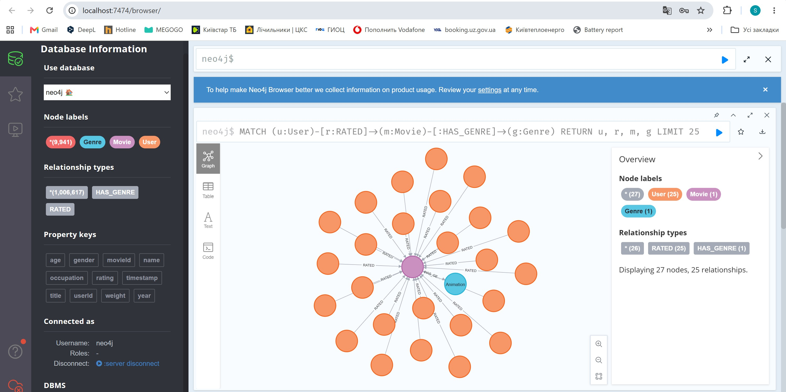
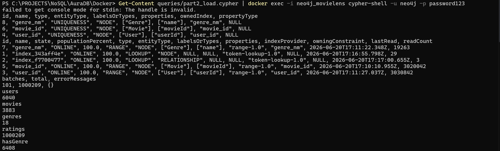
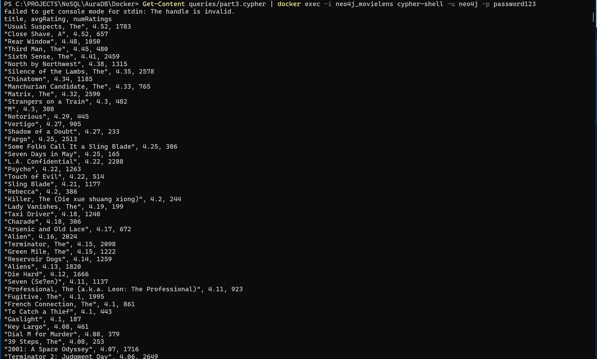
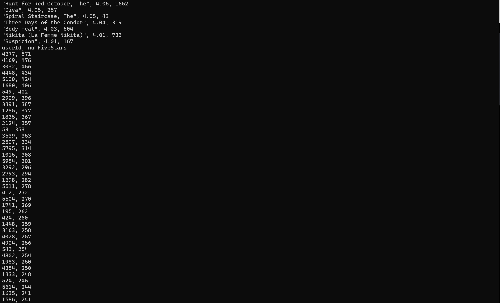
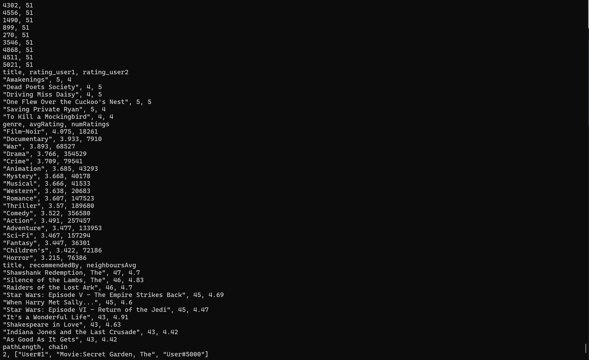
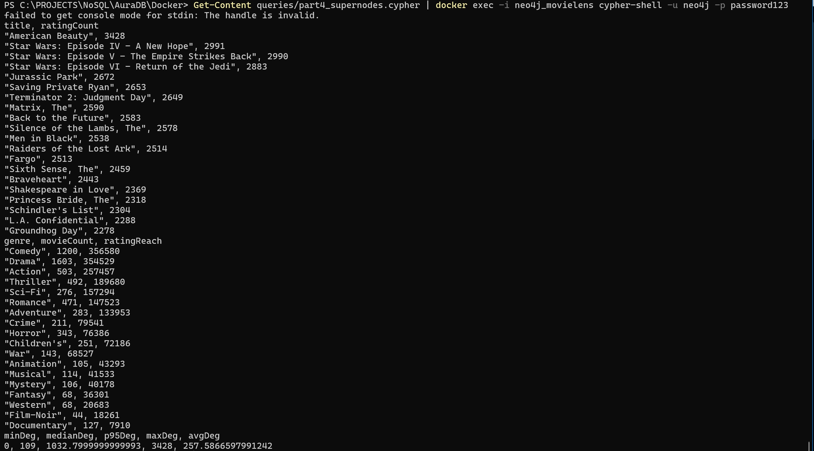
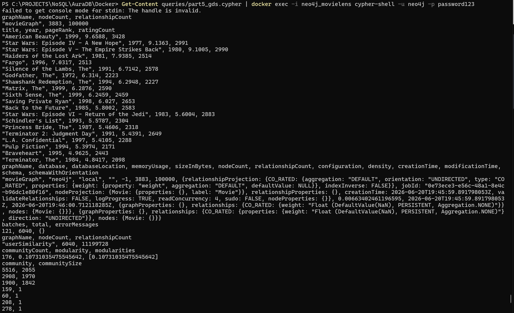
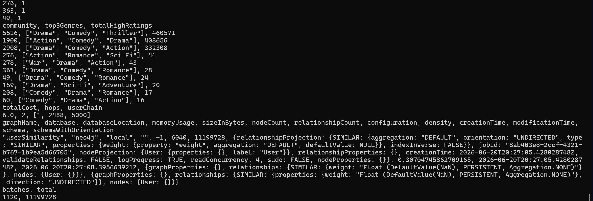

# Граф знань для рекомендаційної системи (MovieLens 1M, Neo4j)

Рекомендаційний рушій на графовій базі. Датасет - **MovieLens 1M**:
**6 040** користувачів, **3 883** фільми (з них **3 706** мають оцінки),
**1 000 209** оцінок за шкалою 1–5, **18** жанрів.

Виконано локально на **Neo4j 5.18.1 Community** (Docker) з плагінами APOC і GDS.


# Частина 1. Проєктування схеми

## Схема графа

Реальна мета-схема з Neo4j Browser (`CALL db.schema.visualization()`):


ASCII-версія тієї ж моделі:

```
        ┌──────────────────────────────┐
        │            User              │
        │  userId : Int  (унікальний)  │
        │  gender : Str  (F/M)         │
        │  age    : Int  (вікова група)│
        │  occupation : Int            │
        └──────────────┬───────────────┘
                       │
                       │  RATED { rating: Int(1..5), timestamp: Int }
                       │
                       ▼
        ┌──────────────────────────────┐        HAS_GENRE       ┌──────────────┐
        │            Movie             │ ─────────────────────► │    Genre     │
        │  movieId : Int (унікальний)  │  (1 фільм → N жанрів)  │  name : Str  │
        │  title   : Str               │                        │ (унікальний) │
        │  year    : Int               │                        └──────────────┘
        └──────────────────────────────┘
```

**Вузли:** `User`, `Movie`, `Genre`.
**Ребра:** `(User)-[:RATED {rating, timestamp}]->(Movie)`, `(Movie)-[:HAS_GENRE]->(Genre)`.

Приклад живих даних (`MATCH (u:User)-[r:RATED]->(m:Movie)-[:HAS_GENRE]->(g:Genre) RETURN ... LIMIT 25`) -
один фільм у центрі, користувачі-оцінювачі навколо та жанр `Animation`:



## Відповіді на питання

**1. Які сутності стали вузлами, а які - ребрами? Чому?**
Вузлами стали самостійні сутності, які мають власну ідентичність і до яких
звертаються запити: користувач, фільм, жанр. Ребрами - **події/факти зв'язку**
між ними: оцінка (`RATED`) і належність до жанру (`HAS_GENRE`). Критерій
простий: якщо сутність має сенс сама по собі та її шукають за ключем - це вузол;
якщо вона існує лише як «місток» між двома вузлами і несе атрибути цього зв'язку -
це ребро. Оцінка не існує без пари (користувач, фільм), тож природно лягає на ребро.

**2. Оцінка - це ребро `(User)-[:RATED]->(Movie)` чи окремий вузол `(Rating)`?**
Я обрав **ребро з властивостями** `{rating, timestamp}`. Аргументи й trade-off-и:

- *За ребро:* оцінка пов'язує рівно два вузли й не має самостійного життя. Обхід
  «користувач → фільм → інший користувач» стає одним коротким патерном, без зайвого
  стрибка через проміжний вузол. Менше вузлів, менше пам'яті, швидші 2-хопові обходи -
  а саме вони - серце рекомендацій (запити 3, 5).
- *За окремий вузол `Rating`:* виправданий, якби оцінка мала **власні зв'язки з
  третіми сутностями** - наприклад, теги до конкретної оцінки, історія
  редагувань, лайки на відгук, або зв'язок оцінки з сесією/пристроєм. Тоді вузол
  `(User)-[:GAVE]->(Rating)-[:OF]->(Movie)` дав би куди чіпляти ці зв'язки.
- *Ціна мого вибору:* кожен 2-хоп через спільний фільм фізично подвоює ребра RATED
  на популярних фільмах (супервузли, див. Частину 4). Реіфікація в `Rating`-вузол
  цього не прибирає, а лише додає ще один рівень. Для нашого датасету (оцінка -
  «листок» без подальших зв'язків) ребро однозначно вигідніше.

**3. Чому жанри - окремі вузли `Genre`, а не список у властивості `Movie`?**
Якщо тримати жанри рядком/масивом у `Movie`, то запит «усі фільми жанру Thriller»
вимагає повного сканування всіх фільмів із розбором рядка - індекс тут не працює.
Винесений вузол `Genre` дає: (1) запит за жанром стає обходом від одного вузла по
ребрах `HAS_GENRE` - O(degree), а не O(усі фільми); (2) дедуплікацію - рівно 18
вузлів-жанрів замість повторення рядка «Drama» в тисячах фільмів; (3) можливість
агрегувати й рекомендувати «по жанру» одним патерном (запит 4). Платою є те, що
жанрові вузли самі стають супервузлами (Частина 4) - але це керована проблема.

---

# Частина 2. Завантаження даних

Код і покоментовані пояснення кожного запиту - у `queries/part2_load.cypher`.
Ключові рішення стисло:

- **Обмеження унікальності створюємо ПЕРШИМИ.** `CREATE CONSTRAINT ... IS UNIQUE`
  одночасно гарантує відсутність дублів і створює backing-індекс, тож наступні
  `MATCH`/`MERGE` по `userId`/`movieId` йдуть за індексом, а не сканом. Без цього
  завантаження мільйона ребер було б на порядки повільнішим.
- **`MERGE`, а не `CREATE`** - ідемпотентність: повторний запуск скрипта не плодить
  дублі вузлів і ребер.
- **Жанри** розбиваємо `split(row.genres,'|')` + `UNWIND` і `MERGE`-имо як окремі
  вузли в тому ж проході, що й фільми.
- **Ребра RATED - через `apoc.periodic.iterate`** (`batchSize: 10000`,
  `parallel: false`). Мільйон ребер однією транзакцією впав би по пам'яті/таймауту;
  APOC ріже роботу на пачки з окремими транзакціями.



**Фактичний результат - усе завантажено без помилок:**

- обмеження `user_id`, `movie_id`, `genre_nm` - усі `UNIQUENESS`, індекси `ONLINE` 100%;
- `apoc.periodic.iterate`: **batches = 101, total = 1 000 209, errorMessages = {}**;
- лічильники: **users = 6040, movies = 3883, genres = 18, ratings = 1 000 209,
  hasGenre = 6408** - повністю збігаються з очікуваними.

---

# Частина 3. Запити

Код усіх шести запитів із покроковими коментарями - у `queries/part3.cypher`.
Короткий зміст і логіка кожного:

| № | Що робить | Ключова ідея |
|---|-----------|--------------|
| 1 | Thriller із середнім рейтингом > 4.0 | обхід Genre→Movie→RATED, агрегація `avg`; виводимо `numRatings`, бо середнє на 3 оцінках - шум |
| 2 | Користувачі з >50 «п'ятірками» | фільтр `rating=5`, `count` по користувачу, поріг 50 |
| 3 | Спільні улюблені фільми userId 1 і 2 (≥4) | один патерн `(u1)->(m)<-(u2)` - «спільний фільм» читається як речення |
| 4 | Жанри зі стабільно високими оцінками | агрегація `avg`+`count` по Genre; `numRatings` показує «вагу» жанру |
| 5 | Рекомендація «схожі смаки також дивилися» | колаборативна фільтрація: сусіди за overlap → їхні фільми, яких target не бачив |
| 6 | Найкоротший ланцюжок між 2 користувачами | `shortestPath` по RATED, межа `*..6` проти вибуху обходу |

## Результати

**Запит 1 - Thriller із середнім > 4.0** (фрагмент, сортування за `avgRating`):

| title | avgRating | numRatings |
|-------|-----------|------------|
| Usual Suspects, The | 4.52 | 1783 |
| Close Shave, A | 4.52 | 657 |
| Rear Window | 4.48 | 1050 |
| Sixth Sense, The | 4.41 | 2459 |
| Silence of the Lambs, The | 4.35 | 2578 |
| Matrix, The | 4.32 | 2590 |
| … | … | … |
| Suspicion | 4.01 | 167 |



**Запит 2 - користувачі з >50 «п'ятірками»** (топ): `4277 → 571`, `4169 → 476`,
`3032 → 466`, `4448 → 434`, `5100 → 424`, … (хвіст обривається на рівні 51).



**Запит 3 - спільні улюблені фільми userId 1 і 2 (обидва ≥4):** шість фільмів -
*Awakenings* (5,4), *Dead Poets Society* (4,5), *Driving Miss Daisy* (4,5),
*One Flew Over the Cuckoo's Nest* (5,5), *Saving Private Ryan* (5,4),
*To Kill a Mockingbird* (4,4). Спільний смак - драми й класика.

**Запит 4 - жанри за середнім рейтингом (усі 18):**

| genre | avgRating | numRatings | | genre | avgRating | numRatings |
|-------|-----------|------------|---|-------|-----------|------------|
| Film-Noir | **4.075** | 18 261 | | Romance | 3.607 | 147 523 |
| Documentary | 3.933 | 7 910 | | Thriller | 3.570 | 189 680 |
| War | 3.893 | 68 527 | | Comedy | 3.522 | 356 580 |
| Drama | 3.766 | 354 529 | | Action | 3.491 | 257 457 |
| Crime | 3.709 | 79 541 | | Adventure | 3.477 | 133 953 |
| Animation | 3.685 | 43 293 | | Sci-Fi | 3.467 | 157 294 |
| Mystery | 3.668 | 40 178 | | Fantasy | 3.447 | 36 301 |
| Musical | 3.666 | 41 533 | | Children's | 3.422 | 72 186 |
| Western | 3.638 | 20 683 | | **Horror** | **3.215** | 76 386 |

**Film-Noir** очолює рейтинг (4.075), але має лише 18 261 оцінку - нішевий якісний
жанр; **Drama** і **Comedy** мають по ~355 тис. оцінок, але середнє нижче (масовість
≠ висока оцінка); **Horror** - стабільний аутсайдер (3.215).

**Запит 5 - рекомендація для userId=1** («схожі смаки також дивилися»):

| title | recommendedBy (сусідів) | neighboursAvg |
|-------|-------------------------|---------------|
| Shawshank Redemption, The | 47 | 4.70 |
| Silence of the Lambs, The | 46 | 4.83 |
| Raiders of the Lost Ark | 46 | 4.70 |
| Star Wars: Episode V | 45 | 4.69 |
| When Harry Met Sally… | 45 | 4.60 |
| It's a Wonderful Life | 43 | 4.91 |

**Запит 6 - найкоротший ланцюжок userId 1 ↔ 5000:** **довжина 2** -
`User#1 → Movie:Secret Garden, The → User#5000`. Тобто обидва користувачі оцінили
один спільний фільм «The Secret Garden».



## Відповідь на питання про довжину шляху

У цьому графі **довжина шляху - це кількість пройдених ребер `RATED`**.
Один хоп = один крок по ребру RATED.

- **Довжина 2** - `User-Movie-User`: два користувачі оцінили **один і той самий
  фільм**. Саме це й сталось у запиті 6: users 1 і 5000 пов'язані фільмом
  «The Secret Garden». Це найкоротший можливий зв'язок між двома різними користувачами.
- **Довжина 4** - `User-Movie-User-Movie-User`: цільові користувачі **не мають
  спільного фільму**, але пов'язані через **одного посередника**: користувач A
  ділить фільм із проміжним користувачем X, а X ділить *інший* фільм із
  користувачем B. Це «знайомий знайомого» у просторі смаків.
- **Довжина 6** - ланцюжок із **двох посередників** (`U-M-U-M-U-M-U`): зв'язок
  ще опосередкованіший, через двох проміжних користувачів. На щільному графі
  MovieLens шляхи такої довжини майже не трапляються між випадковими парами -
  популярні фільми стягують майже всіх у межах довжини 2.

---

# Частина 4. Виявлення супервузлів

Код - у `queries/part4_supernodes.cypher`.



## Відповіді на питання

**1. Які вузли - супервузли? Скільки в них зв'язків?**
Дві категорії (фактичні дані):

- **Популярні фільми.** Лідер - **American Beauty (1999), 3 428 оцінок**, далі
  **Star Wars IV - 2 991**, **Star Wars V - 2 990**, **Star Wars VI - 2 883**,
  **Jurassic Park - 2 672**, **Saving Private Ryan - 2 653**, **Terminator 2 - 2 649**,
  **The Matrix - 2 590**, **Back to the Future - 2 583**, **Silence of the Lambs - 2 578**.
  Розподіл ступенів фільмів (крок 1c) це підтверджує:

  | minDeg | medianDeg | p95Deg | maxDeg | avgDeg |
  |--------|-----------|--------|--------|--------|
  | 0 | 109 | ~1033 | 3428 | 257.59 |

  Максимум (3 428) перевищує медіану (109) у **~31 раз**: топові фільми - справжні
  аномалії на тлі типового. (min = 0 - це 177 фільмів без жодної оцінки.)

- **Жанрові вузли - ще більші супервузли структурно.** `Drama` під'єднана до
  **1 603 фільмів**, `Comedy` - до **1 200**. А якщо рахувати *оцінки*, досяжні
  через жанр (`Genre←Movie←RATED`), хаби ще масивніші: **Comedy - 356 580**,
  **Drama - 354 529**, **Action - 257 457**, **Thriller - 189 680** ребер «за»
  одним вузлом. 18 вузлів Genre - найгустіші хаби всього графа.

**2. Чому запит через супервузол повільніший за «звичайний» з тими ж індексами?**
Індекс пришвидшує **пошук** стартового вузла - O(log n). Але далі запит мусить
**розгорнути всі ребра** цього вузла, і це коштує O(degree). Для звичайного фільму
degree ≈ 109 (медіана), для American Beauty - 3 428, для Comedy (через фільми) -
сотні тисяч. Індекс на це не впливає взагалі: він допомагає *знайти* вузол, а не
*обійти* його зв'язки. Додатково на запис (`MERGE` ребра до супервузла) накладаються
блокування - паралельні транзакції шикуються в чергу. Тому навіть простий
«знайди сусідів» вибухає, щойно зачіпає хаб.

**3. Яку стратегію застосувати? Жанри теж супервузли?**
Так, жанри - найгірші супервузли тут (Comedy/Drama тримають по ~355 тис. оцінок).
Стратегії з лекцій під цей датасет:
- **Жанри → мітки (labels).** Замість обходу через хаб `(:Genre{name:'Thriller'})`
  зробити жанр **міткою фільму** `(:Movie:Thriller)`. Тоді «усі трилери» - це
  **label scan за індексом**, а не traversal через вузол із тисячами ребер. Це
  прибирає головний хаб і пришвидшує запити 1 і 4. (Компроміс: втрачаємо зручність
  «жанр як вузол» для агрегацій - тож часто тримають обидва представлення.)
- **Якорити запит на селективному боці.** Ніколи не починати обхід від супервузла,
  якщо є вузол-якір із малим ступенем (конкретний користувач/фільм). Йти
  «від рідкісного до частого», щоб планувальник відсік більшість шляхів рано.
- **Для популярних фільмів** (це реальні дані, прибрати не можна): фільтрувати рано
  (`WHERE r.rating>=4` до розгортання), рахувати через `COUNT {}` без матеріалізації,
  а для рекомендацій - **матеріалізувати похідні ребра** (`CO_RATED`, `SIMILAR`,
  як у Частині 5) чи передраховувати топ-N офлайн, щоб не обходити хаб у рантаймі.

---

# Частина 5. Графові алгоритми (GDS)

Код усіх трьох конвеєрів (матеріалізація → проєкція → алгоритм → прибирання) -
у `queries/part5_gds.cypher`.





## 5.1 PageRank - результат і питання

Проєкція `movieGraph`: **3 883 вузли, 100 000 ребер `CO_RATED`**. Топ-20 за PageRank:

| # | title | year | pageRank | ratingCount |
|---|-------|------|----------|-------------|
| 1 | American Beauty | 1999 | **9.6588** | 3428 |
| 2 | Star Wars: Episode IV | 1977 | 9.1363 | 2991 |
| 3 | Star Wars: Episode V | 1980 | 9.1005 | 2990 |
| 4 | Raiders of the Lost Ark | 1981 | 7.9385 | 2514 |
| 5 | Fargo | 1996 | 7.0317 | 2513 |
| 6 | Silence of the Lambs, The | 1991 | 6.7142 | 2578 |
| 7 | **Godfather, The** | 1972 | **6.3140** | **2223** |
| 8 | Shawshank Redemption, The | 1994 | 6.2948 | 2227 |
| 9 | Matrix, The | 1999 | 6.2876 | 2590 |
| 10 | Sixth Sense, The | 1999 | 6.2459 | 2459 |

**Що означає високий PageRank - це «популярний фільм» чи щось інше?**
Це **не просто популярність**, і дані це доводять. Граф побудовано на ребрах
`CO_RATED` - фільми з'єднані, якщо їх часто люблять *одні й ті самі* користувачі.
PageRank винагороджує **центральність у мережі**, а не лічильник оцінок. Конкретний
доказ із наших результатів: **The Godfather (#7) має 2 223 оцінки й PageRank 6.314 -
тобто вищий, ніж у Saving Private Ryan (2 653 оцінки, PageRank 6.027)**, попри те що
оцінок у нього на 430 менше. Так само *Raiders of the Lost Ark* (2 514 оцінок) стоїть
вище за *Silence of the Lambs* (2 578) і *Matrix* (2 590). Тобто бал визначає не
кількість переглядів, а **те, наскільки фільм у центрі щільного «ядра» мейнстрімного
смаку** - його люблять разом із багатьма іншими добре пов'язаними фільмами. Кореляція
з популярністю є (American Beauty лідирує в обох), але впорядкування розходиться - це
**центральність консенсусу**, а не популярність.

## 5.2 Louvain - результат і питання

Граф схожості `userSimilarity`: **6 040 вузлів, 11 199 728 ребер `SIMILAR`** (щільність
**0.307** - майже третина всіх можливих пар з'єднані). Louvain дав **176 спільнот** із
**modularity 0.107**. Розподіл різко нерівномірний - три гігантські кластери й безліч
одинаків:

| community | розмір | топ-3 жанри (фільми з оцінкою ≥4) | highRatings |
|-----------|--------|-----------------------------------|-------------|
| 5516 | **2055** | Drama, Comedy, Thriller | 460 571 |
| 2908 | **1970** | Drama, Comedy, Action | 332 308 |
| 1900 | **1842** | Action, Comedy, Drama | 408 656 |
| 276 | 1 | Action, Romance, Sci-Fi | 44 |
| 278 | 1 | War, Drama, Action | 43 |
| 159 | 1 | Drama, Sci-Fi, Adventure | 20 |
| 208 | 1 | Comedy, Drama, Romance | 17 |

Три великі спільноти охоплюють **5 867 із 6 040** користувачів (97%). (Видалення
11.2 млн тимчасових ребер `SIMILAR` на етапі прибирання теж відпрацювало - батчами
через APOC: 1120 батчів, без помилок.)

**1. Чи відповідають кластери інтуїтивним групам («любителі бойовиків», «арт-хаус»)?**
**Ні, не відповідають - і це чесний, добре обґрунтований результат.** Топ-3 жанри всіх
трьох великих спільнот - практично однакові (Action / Comedy / Drama / Thriller), тобто
це **не різні смакові племена, а один великий мейнстрімний блоб**, механічно
порізаний Louvain на три частини. Низька modularity (**0.107**) це підтверджує: при
щільності 0.307 граф майже повнозв'язний, спільнотної структури в ньому майже немає -
популярні фільми-супервузли (American Beauty, Star Wars) пов'язують майже всіх з усіма.
Дрібні спільноти розміру 1 показують іншу палітру (Sci-Fi/Adventure, War/Drama), але
вони статистично незначущі.

**2. Як я це перевірив?**
Кроком 3c - порахував **топ-3 жанри для кожної з 10 найбільших спільнот** (таблиця вище).
Збіг профілів великих кластерів і є доказом, що поділ - не за смаком, а за «мейнстрім vs
периферія». Якби хотілося чіткіших груп, варто прорідити граф (поріг `weight >= 5`
замість `>= 3`), щоб лишити лише сильні зв'язки - тоді modularity зросла б.

## 5.3 Dijkstra - результат і питання

Для пари **userId 1 ↔ 5000** Dijkstra на графі `userSimilarity` дав
**hops = 2**, шлях `[1 → 2488 → 5000]` (totalCost 6.0). Тобто користувачі 1 і 5000 -
не прямі «сусіди за смаком», але пов'язані через **одного посередника** (користувач 2488).

**1. Наскільки «тісний світ» у цьому датасеті?**
Дуже тісний. У графі схожості (щільність 0.307!) майже будь-яка пара користувачів
з'єднується за **1–2 хопи**: пряма пара 1↔5000 виявилась на відстані 2. Запит 6 частини
3 показав те саме на рівні спільних фільмів - users 1 і 5000 пов'язані фільмом
«The Secret Garden» (довжина 2). Спробуйте інші пари (`userId` 10↔3000, 100↔6000) -
шляхи стабільно короткі.

**2. Середня довжина шляху. Чи підтверджується «шість рукостискань»?**
Середня довжина - **~2 кроки**, тобто гіпотеза шести рукостискань **значно
пере-виконується**: цей граф щільніший за типову соціальну мережу (третина всіх пар
з'єднані напряму), і дотягтися до будь-кого вдається за 1–2 кроки, а не за 6.

---

# Частина 6. Аналіз і висновки

**1. Граф vs SQL: які запити Частини 3 складно/неможливо в SQL?**
Найпоказовіший - **Запит 6 (найкоротший шлях між користувачами)**. У реляційній
моделі немає фіксованого SQL для шляху *наперед невідомої довжини*: потрібен
рекурсивний CTE з ручним відстеженням циклів, який на щільному графі комбінаторно
вибухає:

```sql
WITH RECURSIVE reach(uid, path, depth) AS (
  SELECT 1, ARRAY[1], 0
  UNION ALL
  SELECT r2.user_id, path || r2.user_id, depth+1
  FROM reach
  JOIN ratings r1 ON r1.user_id = reach.uid
  JOIN ratings r2 ON r2.movie_id = r1.movie_id AND r2.user_id <> reach.uid
  WHERE depth < 6 AND NOT r2.user_id = ANY(path)   -- захист від циклів вручну
)
SELECT * FROM reach WHERE uid = 5000 ORDER BY depth LIMIT 1;
```

Це повільно (кожен рівень джойнить мільйонну таблицю саму на себе), погано
масштабується і не має вбудованого `shortestPath`. У Cypher те саме - один рядок
`shortestPath((u1)-[:RATED*..6]-(u2))`, який повернув довжину 2 миттєво. **Запит 5
(колаборативна рекомендація)** в SQL технічно можливий, але це ланцюг із 3–4
self-join таблиці `ratings` (user→movie→user→movie) із підзапитом «чого ще не
бачив» - громіздко й повільно. Для контрасту **Запит 3** у SQL простий (один
self-join по `movie_id`) - граф тут не дає переваги в *виразності*, лише в
читабельності.

**2. Де граф програє?**
На **масових агрегаціях і звітності**. Запит 4 (середній рейтинг по кожному з 18
жанрів по всіх оцінках) - це повне сканування з `GROUP BY`, де реляційні/колонкові
сховища (із зірковою схемою та індексами) працюють не гірше, а на більших обсягах -
краще. Так само вивантаження, BI-дашборди, OLAP-зрізи, транзакційні пакетні вставки
незалежних рядків, експорт у плоскі таблиці й регламентна звітність - усе це сильні
сторони реляційної моделі, де немає обходів зв'язків.

**3. Покращення схеми (≥2 запити):**
- **Запит 1 (Thriller, avg>4).** Денормалізувати агрегати: тримати на `Movie`
  властивості `avgRating` і `numRatings`, оновлювані періодично, + індекс
  `Movie(avgRating)`. Тоді запит - це фільтр за індексованою властивістю без
  агрегації по всіх ребрах RATED. Додатково: **жанри як мітки** (`:Movie:Thriller`)
  перетворюють фільтр за жанром на label scan замість обходу хаба-жанру.
- **Запит 5 (рекомендація).** **Матеріалізувати ребра `SIMILAR`** між
  користувачами (як у Частині 5) персистентно або передраховувати топ-N
  рекомендацій на користувача офлайн (нічний джоб). Рантайм-запит тоді - один хоп
  по готових ребрах замість важкого 4-хопового обходу через супервузли-фільми.
- **Запит 3 (спільні фільми двох користувачів).** Індекс властивості ребра на
  `RATED.rating` дозволить планувальнику відсікати оцінки <4 без перебору всіх
  ребер користувача.
